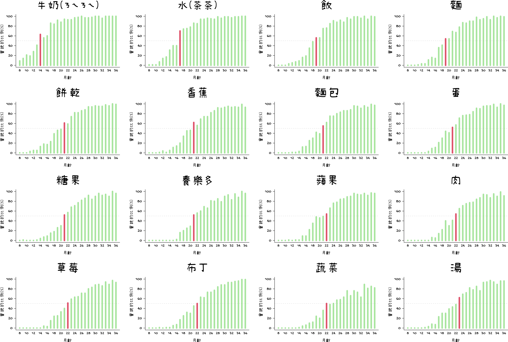
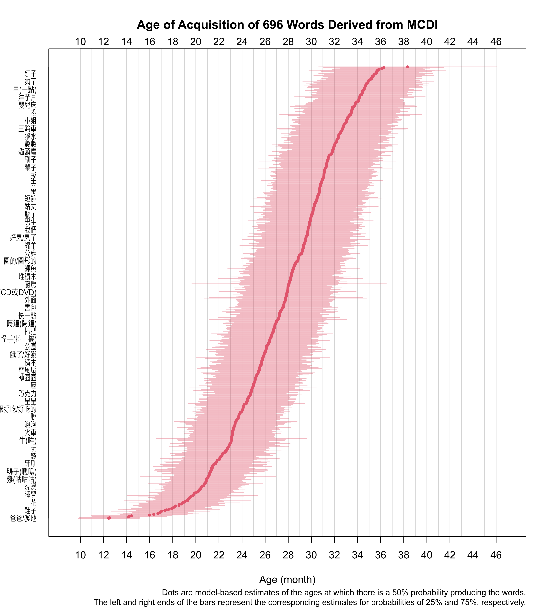

Age of Acquisition of 696 Words in Mandarin (Taiwan)
====================================================

The distributions of ages at which words are produced are shown in the figures below. These age distributions were calculated from data collected by Liu & Tsao (2010), available from the Wordbank project (Frank et al., 2017) at <https://github.com/langcog/wordbank>.

下圖為696個華語詞彙產出的年齡分配。這些分配是根據 Liu 與 Tsao (2010) 所收集之 MCDI 資料計算而得。原始資料來源為 Wordbank 專案 (Frank 等，2017): <https://github.com/langcog/wordbank>。

Data
----

Raw data (copied from [Wordbank](https://github.com/langcog/wordbank)) can be found in `raw/`, and the age distribution data is available in `made/MCDI.age.csv`.

References
----------

Frank, M. J., Braginsky, M., Yurovsky, D., & Marchman, V. A. (2017). Wordbank: An open repository for developmental vocabulary data. Journal of Child Language, 44(3), 677–694. Cambridge Core. https://doi.org/10.1017/S0305000916000209

劉惠美(Huei-Mei Liu) & 曹峰銘(Feng-Ming Tsao). (2010). 華語嬰幼兒溝通發展量表之編製與應用(The Standardization and Application of
Mandarin-Chinese Communicative Developmental Inventory for Infants and
Toddlers). 中華心理衛生學刊(Formosa Journal of Mental Health), 23(4), 503–534. https://doi.org/10.30074/FJMH.201012_23(4).0001
